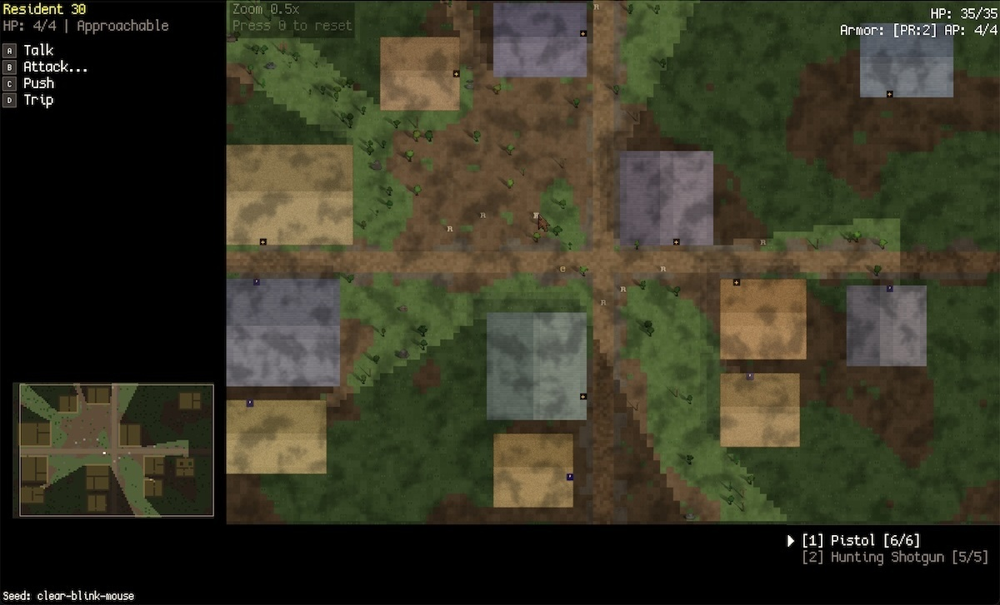

# Brileta

Brileta is a game engine and sandbox written in Python and C, built for experimenting with game mechanics, graphics, and procedural generation. There's no underlying framework - rendering, input, audio, lighting, AI, and world generation are all homegrown, with WGPU for GPU access and C extensions for hot paths. It has roguelike bones: tile-based maps, turn-based play, procedural worlds, and per-entity procedural sprites.

The current sandbox generates a settlement and drops you into it. Everything is deterministic from a single seed.

## Notable Systems

### Shader-Driven Lighting

- Per-tile illumination computed in WGPU fragment shaders, composited over the glyph layer in a separate pass.
- Multiple concurrent point lights with distance falloff and dynamic flicker driven by shader-side noise.
- Directional sun with ray-marched terrain shadows that shift in angle and length with time of day.
- Actors and terrain cast glyph-shaped shadows that shift with sun angle and nearby point lights.
- Sky exposure for indoor/outdoor transitions and emission for glowing surfaces.
- Edge blending feathers natural terrain boundaries with per-pixel noise jitter, so grass bleeds organically into dirt while built surfaces like cobblestone keep hard edges.

### Composable World Generation

- Pipeline of generation layers that each transform a shared context.
- Terrain shaped by layered noise fields at two scales - broad passes carve meadows and clearings, while a high-frequency layer scatters small patches for variety. Settlement infrastructure is carved into the natural landscape afterward, so buildings and streets read as built on pre-existing land.
- Buildings placed from templates with configurable footprints.
- Generated regions track properties like sky exposure that feed into the lighting system.
- Each subsystem gets its own isolated RNG stream derived from a master seed, so changes to one system's random consumption don't cascade to others.

### Procedural Sprites

- Every actor and environmental object is a unique sprite, generated per-pixel from a deterministic seed.
- Trees use four archetypes with lobe-based canopy geometry, varying by silhouette and color. Boulders vary by proportion and stone color, with procedural cracks and lichen patches. Both use three-step shading (shadow, mid-tone, highlight).
- Character sprites are assembled layer-by-layer - body, clothing, hair - with directional poses and appearance variation driven by a per-actor seed.
- Billboard sun lighting in the fragment shader shifts highlights across sprite pixels as the sun moves.
- Dynamic sprite atlas with skyline bin-packing integrates procedural sprites into the rendering pipeline.

### Utility AI with Goals

- Each tick, every available action is scored against a context built from health, threat proximity, escape routes, and other inputs.
- Multi-turn behaviors like fleeing or patrolling create Goals that compete in the same scoring system as one-shot actions.
- Persistence bonus scales with goal progress - an NPC most of the way through fleeing is harder to distract than one that just started.

### Declarative Actions

- Player and NPC actions go through the same pipeline.
- Plans are declarative sequences of movement and action steps, with optional skip-if predicates.
- Each step produces a pure-data intent, dispatched to a specialized executor.
- Pathfinding supports hierarchical cross-region routing via a region graph built during world generation.

### Effects & Presentation

- Sub-tile particle system layered over the glyph grid.
- Directional muzzle flash cones and blood splatter that persists as floor decals.
- Presentation manager staggers NPC action feedback so simultaneous turns read as a sequence.
- Positional audio with distance-based falloff, listener position smoothing, and variant selection.

### C Extensions for Hot Paths

- A shared native extension for A\* pathfinding, symmetric shadowcasting FOV, sprite rasterization, and noise generation.

## Getting Started

1. Install [uv](https://docs.astral.sh/uv/getting-started/installation/).
2. Run `uv sync`.
3. Run `make`.
4. Run the sandbox with `make run`.

## License

Licensed under [AGPL-3.0](LICENSE). See [NOTICE](NOTICE) for third-party attributions.
